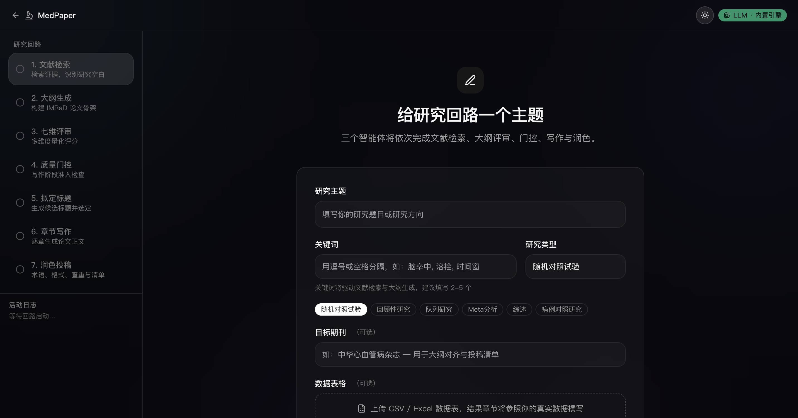
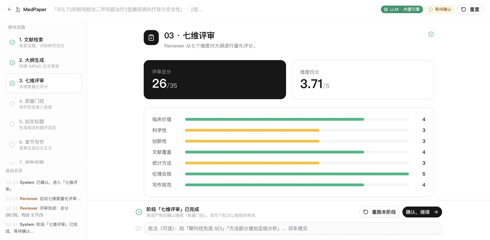

# MedPaper · 医学论文写作全流程自动化平台

给一个研究主题，三个智能体协同跑完整个写作回路：文献检索、大纲评审、质量控制、拟定标题、章节写作、润色投稿——每一步完成都会停下来等你确认，确认后才继续。

**在线体验**：https://wannengxiaodie.github.io/medpaper/

> 线上版本为纯静态托管，需在「大模型接入」中填入自己的 API Key 才能启动真实生成（Key 仅保存在你的浏览器本地）；不填 Key 则为演示模式。

## 界面预览

| 暗色主题（默认） | 亮色主题 |
| --- | --- |
|  |  |

| 工作台 | 章节写作 |
| --- | --- |
|  |  |

## 核心特性

- **7 阶段研究回路**：文献检索 → 大纲生成 → 七维评审 → 质量控制 → 拟定标题 → 章节写作 → 润色投稿
- **三智能体协同**：Strategist（选题策略 · 文献分析 · 标题拟定）、Reviewer（七维评审 · 质量控制 · 统计审查）、Composer（大纲生成 · 章节写作 · 润色投稿）
- **逐步确认门**：每个阶段完成后暂停，可「确认继续」「重跑本阶段」或写批注让智能体修改，全流程可控
- **真实文献，拒绝编造**：
  - 英文文献：Europe PMC / PubMed 实时检索，含 PMID / DOI / 被引数
  - 中文文献：知网导出文件导入（GB/T 7714-2015 / EndNote / NoteExpress），逐字保留原始著录
- **自带数据接入**：上传 CSV / Excel 数据表，结果章节参照你的真实数据撰写
- **七维量化评审**：临床价值、科学性、创新性、文献覆盖、统计方法、伦理合规、写作规范，未达准入标准不进入写作
- **投稿级输出**：术语规范化、格式校验、查重检测、投稿清单，一键导出 Word（.docx）成稿
- **明暗双主题 + 科幻流体光影背景**，主题选择持久化
- **BYOK 多服务商**：支持任何 OpenAI 兼容端点（Kimi / DeepSeek / 通义千问 / OpenAI / 自定义），密钥只存浏览器本地

## 技术栈

React 19 · TypeScript · Vite · Tailwind CSS · shadcn/ui · React Router · next-themes · docx · xlsx

## 本地运行

```bash
npm install
npm run dev        # 默认 http://localhost:7100
```

本地开发自带 LLM 网关（Vite 中间件）：在环境变量中配置 `KIMI_API_KEY` 与 `KIMI_BASE_URL` 即可使用内置引擎，无需在前端填 Key；未配置时自动降级为演示模式。

## 一键部署（GitHub Pages）

```bash
./deploy.sh "提交说明"
```

自动完成：构建验证 → 推送 main → 按 Pages 子路径重建（含 404 回退页）→ 发布 gh-pages。约 1 分钟后线上生效。

## 项目结构

```
src/
├── engine/        # 研究回路引擎：pipeline、LLM 客户端、评审、质量控制、导出
│   ├── llm.ts     # LLM 调用（浏览器直连 BYOK / 本地代理内置引擎）
│   ├── pubmed.ts  # Europe PMC / PubMed 真实文献检索
│   ├── cnki.ts    # 知网导出文件解析（GB/T 7714 / RIS / Refworks）
│   └── ...
├── pages/         # Home 落地页 / Workspace 工作台
├── components/    # 流体光影背景、主题切换、shadcn/ui 组件
└── sections/      # 各阶段产物展示组件
```

## 作者

wangpengfei
